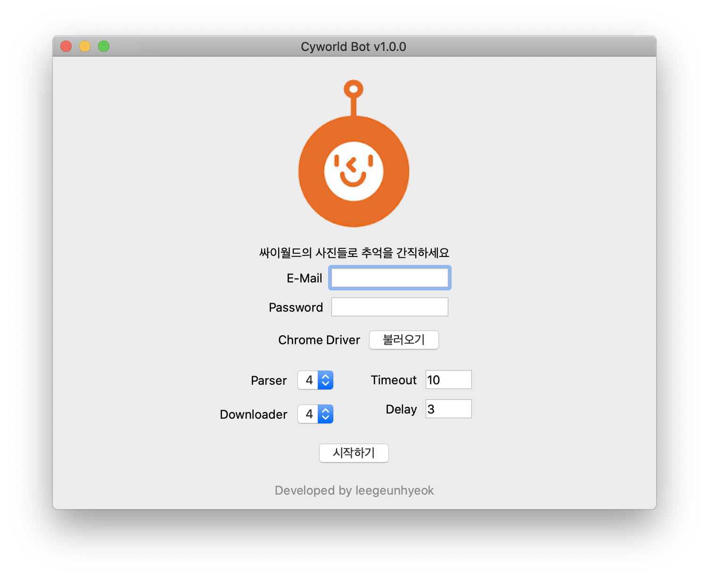
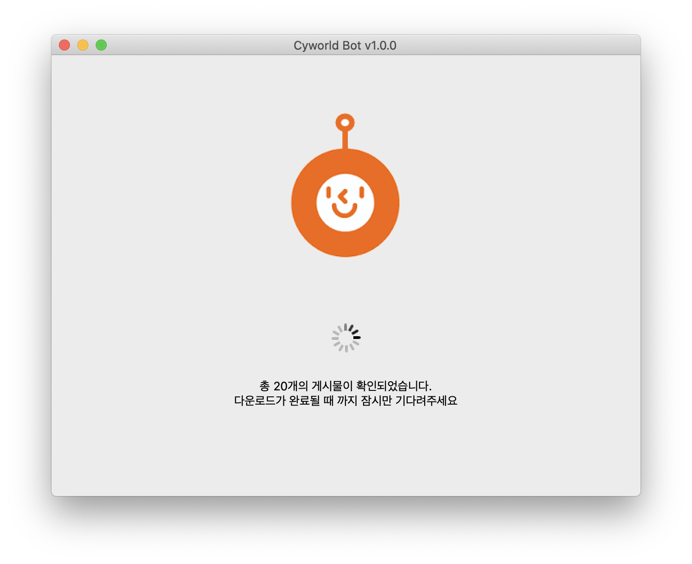
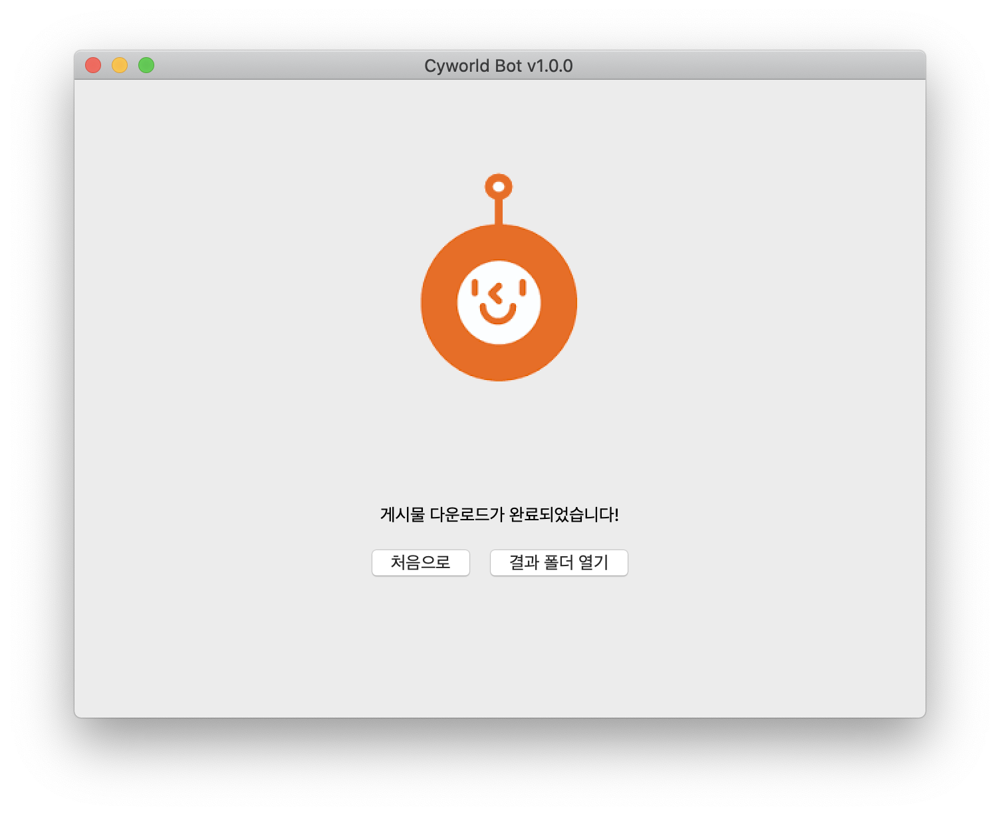
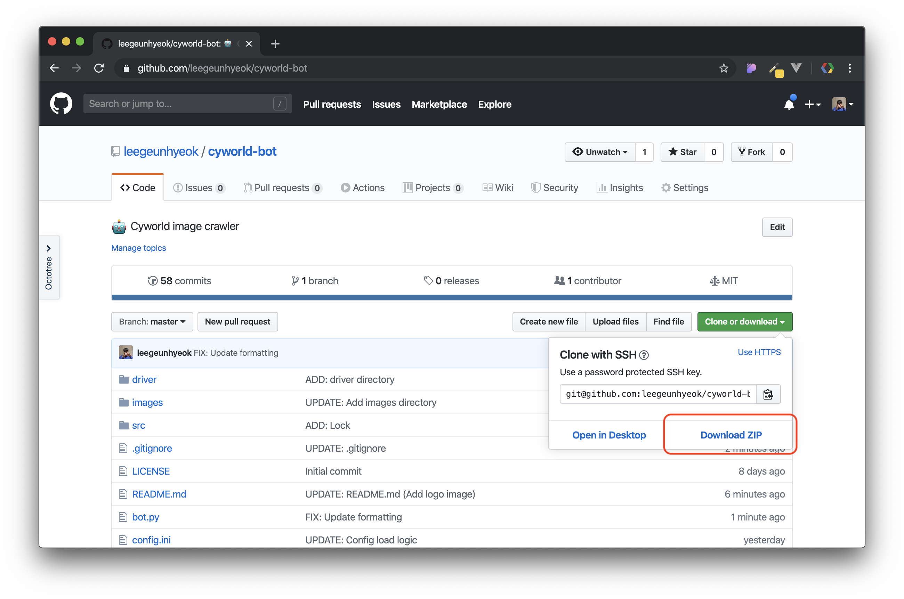
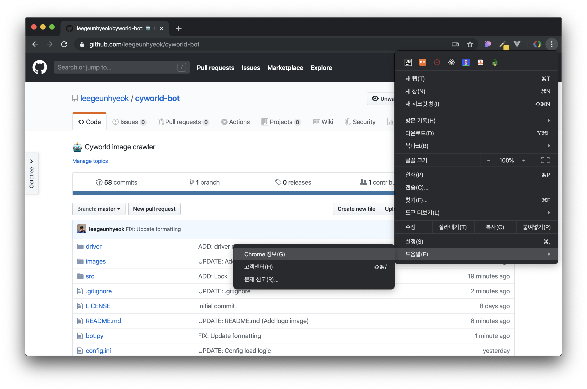
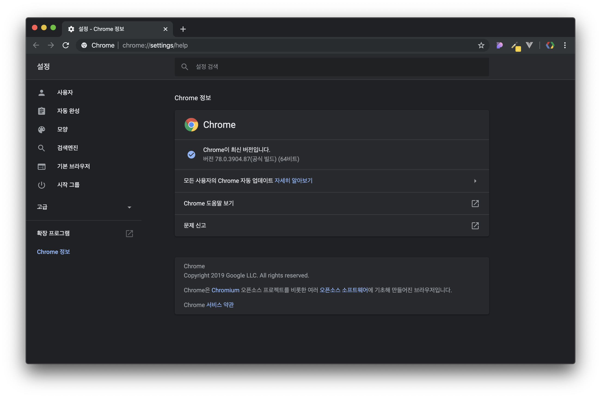
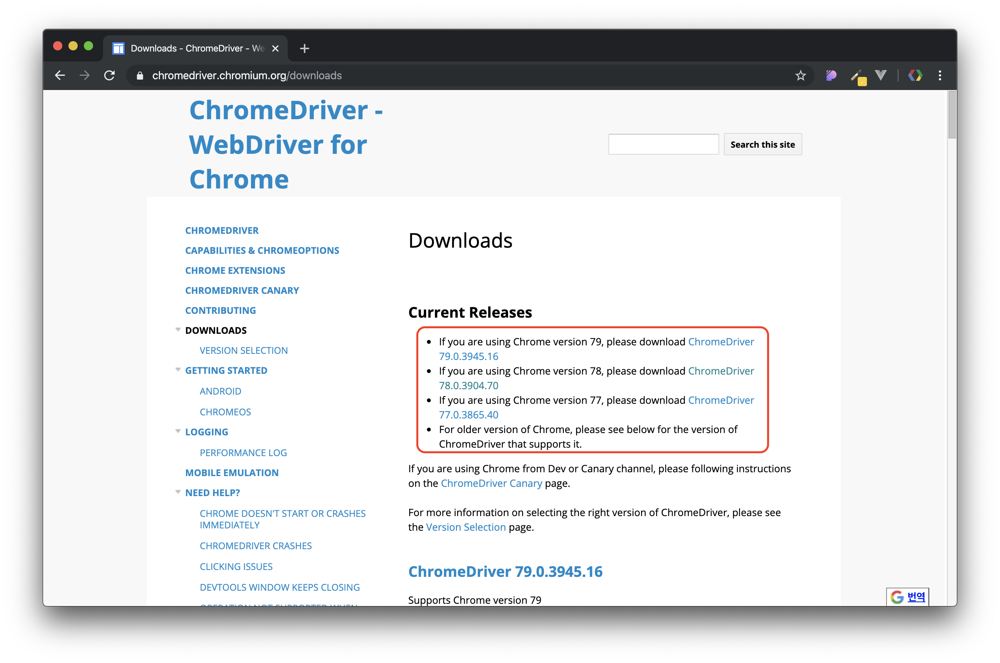
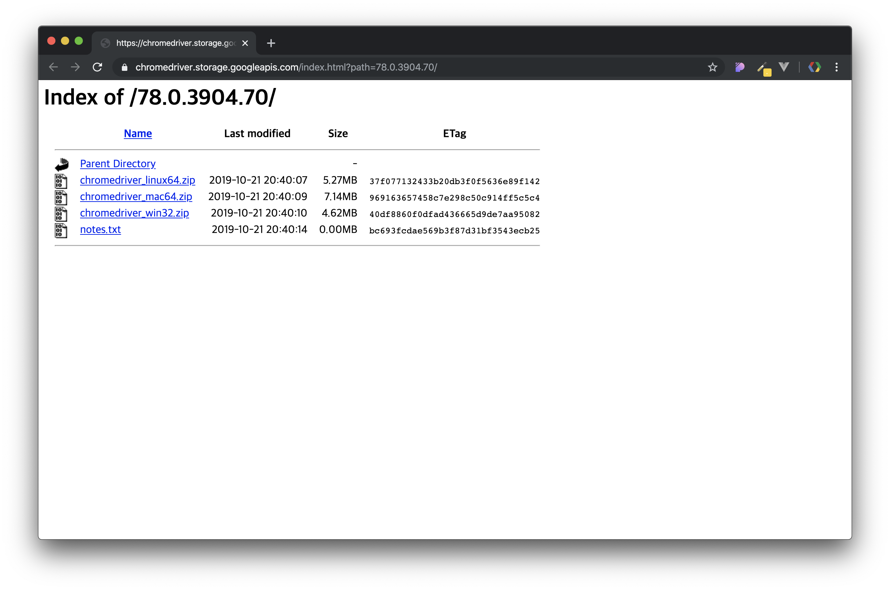
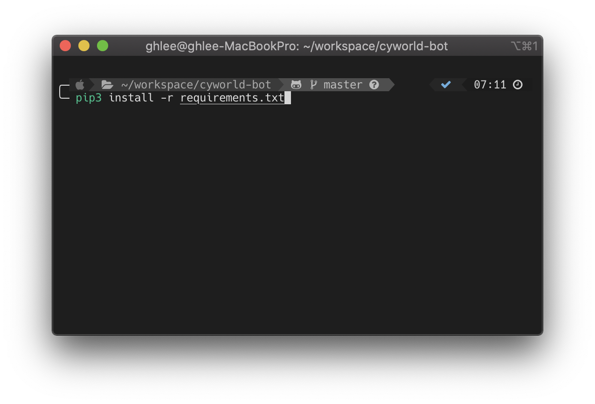
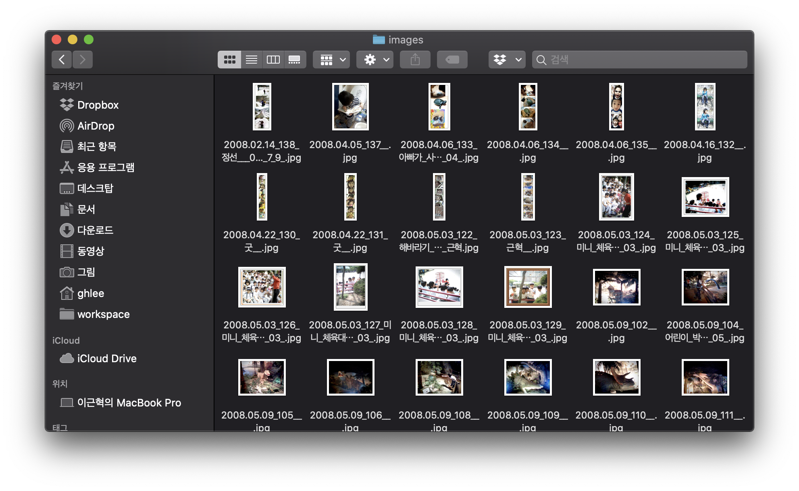

<div align="center">
  

싸이월드의 사진들로 추억을 간직하세요
</div>

## 설치 및 사용법 - GUI 방식 (추천)

### 0. 사전 준비

정상적인 실행을 위해 크롬 드라이버가 필요합니다.
- 크롬 드라이버 - [다운로드](https://sites.google.com/a/chromium.org/chromedriver/downloads)

### 1. 프로그램 다운로드



- CyBot 실행 파일 [다운로드](#)
  - 운영체제에 맞는 파일을 다운로드 받아주세요 (Windows, macOS)

### 2. 기본 정보 입력



사용자 계정 정보를 올바르게 입력해주세요

### 3. 크롬 드라이버 선택 및 옵션 지정



- 크롬 드라이버 선택 버튼을 눌러 사전 준비 단계에서 다운로드받은 `크롬 드라이버 파일`을 선택해주세요
  - 다운로드받은 크롬 드라이버 파일은 압축 해제해야합니다.
- parser, downloader 프로세스 수를 지정할 수 있습니다.
- timeout: 페이지 로딩 대기시간입니다. 싸이월드 접속 시 해당 시간만큼 대기하며, 초과할 경우 작업을 중단합니다.
  - 로그인 시도, 홈 페이지로 이동 중 오류가 발생할 경우 timeout 값을 더 늘린 후 다시 시도해주세요
- delay: 싸이월드 서버 부하 방지를 위한 CyBot 자체 대기시간입니다.
  - 기본값 사용을 추천합니다.

### 4. 완료


시작하기 버튼을 눌러 작업을 진행할 수 있습니다.


작업이 완료되면 메시지와 함께 결과물을 확인할 수 있는 버튼이 표시됩니다.


## 설치 및 사용법 - CLI 방식

### 0. 사전 준비

- 파이썬3 - [다운로드](https://www.python.org/downloads/release/python-365)
- 구글 크롬 브라우저 - [다운로드](https://www.google.com/intl/ko/chrome)
- 크롬 드라이버 - [다운로드](https://sites.google.com/a/chromium.org/chromedriver/downloads)

아래 가이드를 통해 상세한 설치 방법을 확인하실 수 있습니다.


### 1. 소스코드 다운로드



`Clone or download` 버튼을 눌러 ZIP 파일로 소스코드를 다운로드 받습니다.
- 다운로드 받은 후 압축을 풀어주세요

### 2. 크롬 브라우저 버전 확인



`메뉴 > 도움말 > Chrome 정보` 순서대로 진입하여 정보창으로 진입합니다.



크롬 정보창에서 크롬 버전의 맨 앞자리를 메모해주세요 (위 사진의 경우 78)

### 3. 크롬 드라이버 다운로드



[크롬 드라이버 다운로드](https://chromedriver.chromium.org/downloads) 페이지에 접속하여 `3번` 과정에서 메모한 버전과 일치하는 드라이버를 다운로드 받습니다.



컴퓨터 운영체제에 맞는 버전을 다운로드 받고 압축을 풀어줍니다.
- 압축 해제 후 나온 파일은 driver 폴더에 넣어주세요

### 4. 의존 라이브러리 설치



CMD 혹은 터미널 등을 소스코드가 있는 폴더에서 열어 아래 명령어를 입력합니다.

- [파이썬](https://www.python.org/downloads/release/python-365)이 설치되어 있어야 합니다!

```bash
pip3 install -r requirements.txt
```

### 5. 기본 설정

- `config.ini` 파일을 열어 개인 설정을 진행해주세요
  - user
    - email: 싸이월드 이메일
    - password: 비밀번호
  - bot
    - chromedriver: 크롬드라이버 경로
      - 윈도우: ./driver/chromedriver.exe
      - 리눅스 & 맥: ./driver/chromedriver
    - wait: 크롬드라이버 대기시간 (초)
      - 네트워크 환경이 좋지 않아 로그인, 홈으로 이동 과정 등에서 시간초과 오류가 발생할 경우 적절히 조절해주세요
    - delay: 다운로드 지연시간 (되도록이면 기본값인 3초를 유지해주세요)
    - parser: 파싱 프로세스 수
      - ⚠️ CPU 코어 수보다 큰 수를 입력하지 않는것을 추천합니다. (1 ~ 코어 수)
    - downloader: 다운로더 프로세스 수
      - ⚠️ CPU 코어 수보다 큰 수를 입력하지 않는것을 추천합니다. (1 ~ 코어 수)

```
[user]
email=이메일
password=비밀번호

[bot]
chromedriver=./driver/chromedriver.exe
delay=3
parser=4
downloader=4
```

### 6. 실행

아래 명령어를 입력하여 싸이월드 이미지 수집을 시작할 수 있습니다.

```bash
python3 bot.py
```



- 결과 이미지는 images 폴더 내에 `날짜_번호_제목` 형식으로 저장됩니다
- 결과 텍스트는 posts 폴더 내에 `날짜_번호_제목` 형식으로 저장됩니다


## GUI(PyQt5) 빌드

```bash
# Windows
pyinstaller -w -F -i=icon.ico --add-data "icon.ico;." --add-data "logo.png;." --add-data "loading.gif;." --name CyBot --clean bot-gui.py

# Mac OS
pyinstaller -w -F -i=icon.icns --add-data icon.icns:. --add-data logo.png:. --add-data loading.gif:. --name CyBot --clean bot-gui.py
```

- `-w`: 콘솔창 숨기기 (윈도우 모드)
- `-F`: 하나의 파일로 번들링
- `-i`: 애플리케이션 아이콘 지정
- `--add-data`: 애플리케이션 리소스 지정
- `--name`: 빌드 결과물 파일먕
- `--clean`: 임시파일 및 캐시 삭제

## 이슈
사용 중 문제가 발생할 경우 [이슈](https://github.com/leegeunhyeok/cyworld-bot/issues) 남겨주세요 😊

## 개발자
[Geunhyeok LEE](https://github.com/leegeunhyeok)
