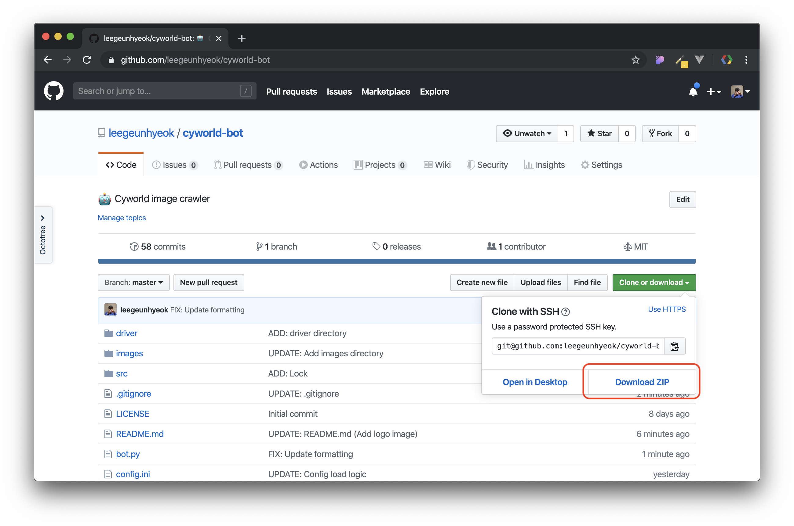
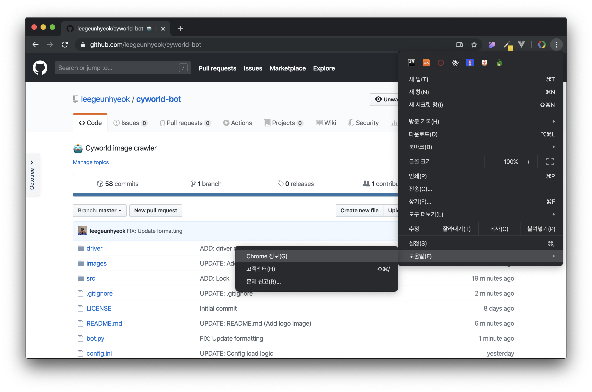
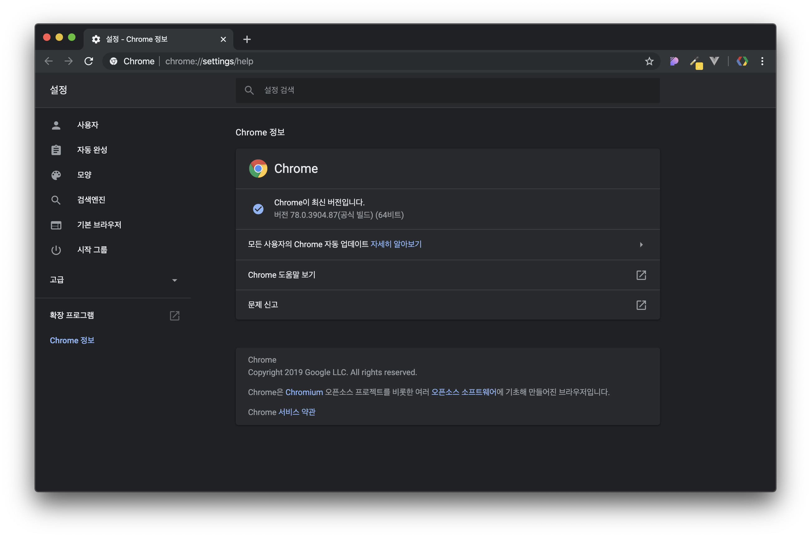
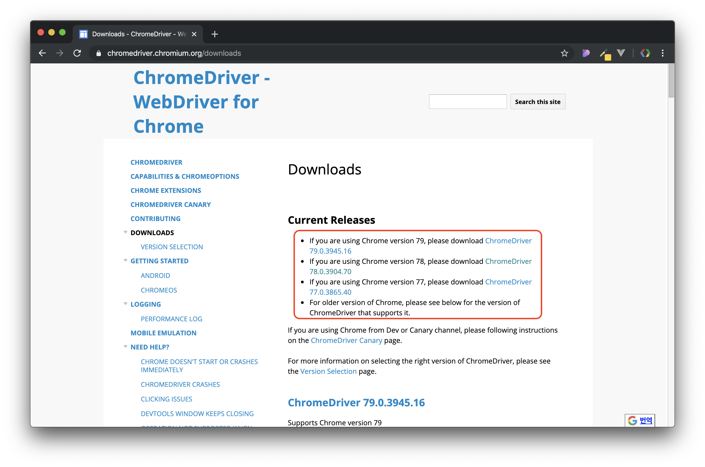
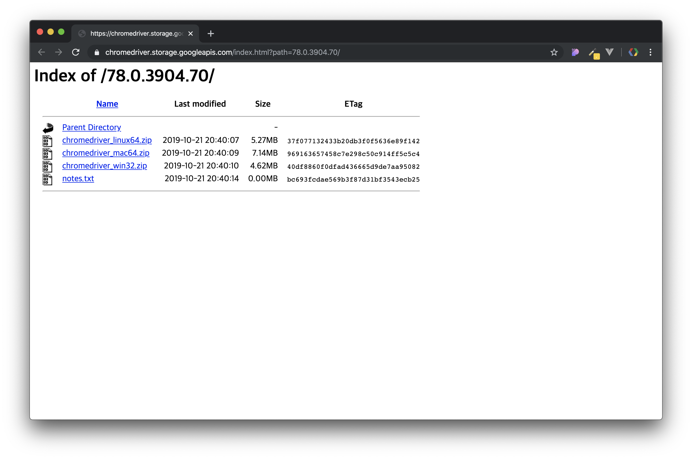
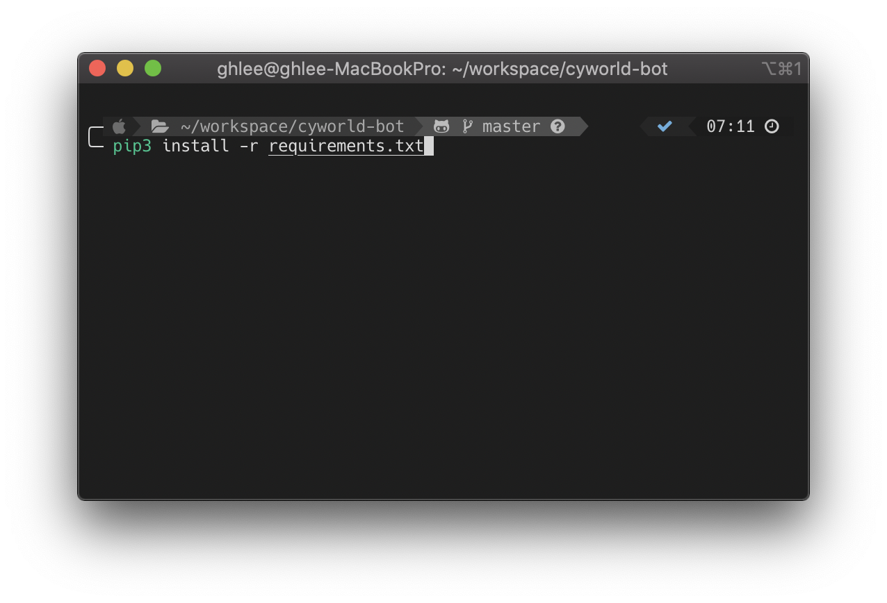
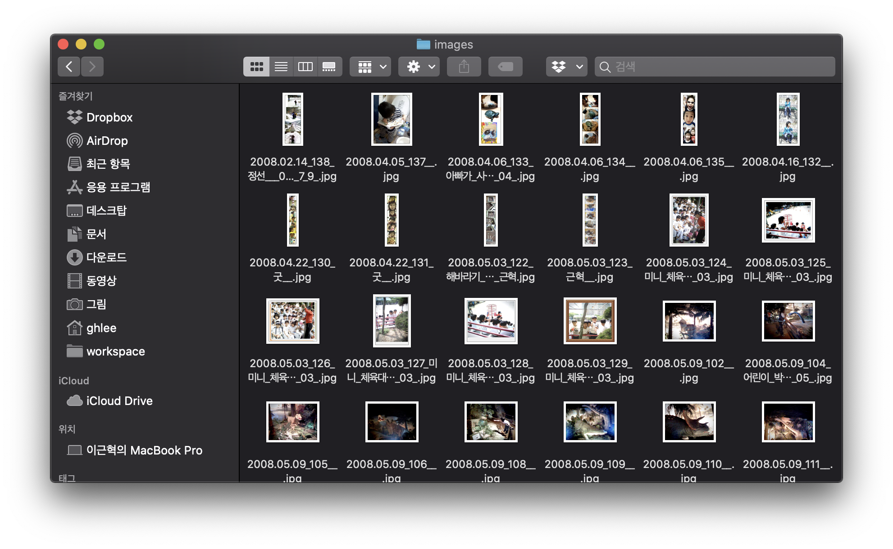

<div align="center">
  

싸이월드의 사진들로 추억을 간직하세요
</div>


## 설치

### 0. 사전 준비

- 파이썬3 - [다운로드](https://www.python.org/downloads/release/python-365)
- 구글 크롬 브라우저 - [다운로드](https://www.google.com/intl/ko/chrome)
- 크롬 드라이버 - [다운로드](https://sites.google.com/a/chromium.org/chromedriver/downloads)

아래 가이드를 통해 상세한 설치 방법을 확인하실 수 있습니다.


### 1. 소스코드 다운로드



`Clone or download` 버튼을 눌러 ZIP 파일로 소스코드를 다운로드 받습니다.

### 2. 크롬 브라우저 버전 확인



`메뉴 > 도움말 > Chrome 정보` 순서대로 진입하여 정보창으로 진입합니다.



크롬 정보창에서 크롬 버전의 맨 앞자리를 메모해주세요 (위 사진의 경우 78)

### 3. 크롬 드라이버 다운로드



[크롬 드라이버 다운로드](https://chromedriver.chromium.org/downloads) 페이지에 접속하여 `3번` 과정에서 메모한 버전과 일치하는 드라이버를 다운로드 받습니다.



컴퓨터 운영체제에 맞는 버전을 다운로드 받고 압축을 풀어줍니다.
- 압축 해제 후 나온 파일은 driver 폴더에 넣어주세요

### 4. 의존 라이브러리 설치



CMD 혹은 터미널 등을 소스코드가 있는 폴더에서 열어 아래 명령어를 입력합니다.

```bash
pip3 install -r requirement.txt
```

### 5. 기본 설정

- `config.ini` 파일을 열어 개인 설정을 진행해주세요
  - user
    - email: 싸이월드 이메일
    - password: 비밀번호
  - bot
    - chromedriver: 크롬드라이버 경로
      - 윈도우: ./driver/chromedriver.exe
      - 리눅스 & 맥: ./driver/chromedriver
    - delay: 다운로드 지연시간
    - parser: 파싱 프로세스 수
      - ⚠️ CPU 코어 수보다 큰 수를 입력하지 않는것을 추천합니다. 
    - downloader: 다운로더 프로세스 수
      - ⚠️ CPU 코어 수보다 큰 수를 입력하지 않는것을 추천합니다.

```
[user]
email=아이디
password=비밀번호

[bot]
chromedriver=./driver/chromedriver.exe
delay=3
parser=4
downloader=4
```

### 6. 실행

아래 명령어를 입력하여 싸이월드 이미지 수집을 시작할 수 있습니다.

```bash
python3 bot.py
```



- 결과 이미지는 images 폴더 내에 `날짜_번호_제목` 형식으로 저장됩니다
- 결과 텍스트는 posts 폴더 내에 `날짜_번호_제목` 형식으로 저장됩니다

## 이슈
사용 중 문제가 발생할 경우 [이슈](https://github.com/leegeunhyeok/cyworld-bot/issues) 남겨주세요 😊

## 개발자
[Geunhyeok LEE](https://github.com/leegeunhyeok)
